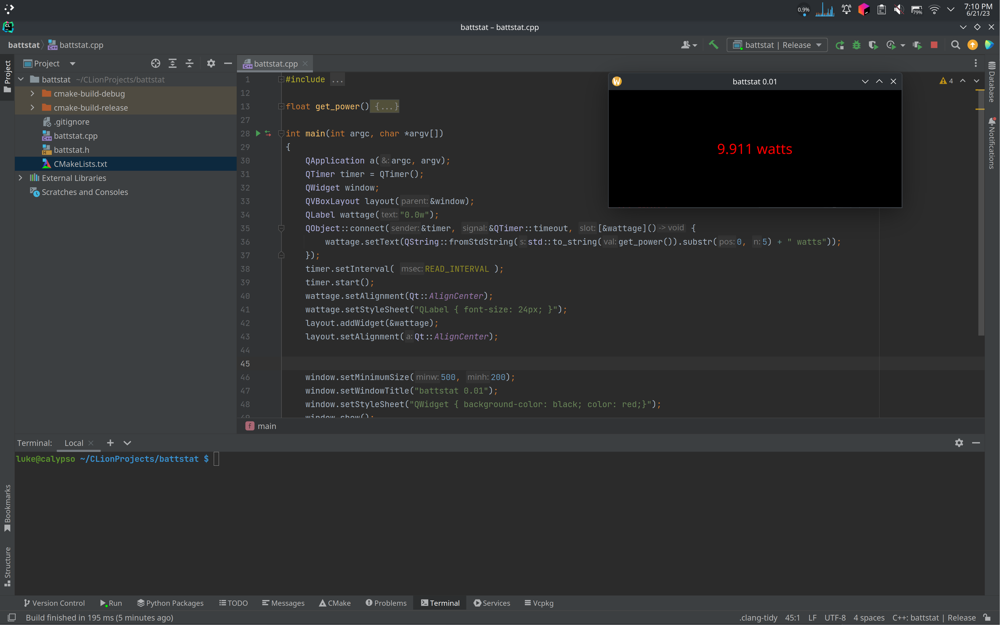

# battstat
simple qt5 app that displays the current battery wattage (in or out)

### caveats
- i wrote it in an hour
- there's no way to tell (yet) if you are charging or discharging
- linux only
- only shows the wattage from one battery at a time

